<!-- AUTOGENERATED FILE - DO NOT EDIT. -->
<!-- Edit README.tmpl.md; scripts/render.mjs regenerates this file. -->

<!-- Source of truth for the profile README. scripts/render.mjs turns this into README.md and draws everything in assets/. Edit here, not there. -->

<a href="https://ducmai.me"></a>

  
  
  
  
  <a href="#l4--rendering"></a>

  <a href="https://ducmai.me">ducmai.me</a> ·
  <a href="https://www.linkedin.com/in/maitrungduc1410">LinkedIn</a> ·
  <a href="https://x.com/maitrungduc1410">X</a> ·
  <a href="https://viblo.asia/u/maitrungduc1410">Viblo</a> ·
  <a href="mailto:maitrungduc1410@gmail.com">Email</a>

## L0 · Surface

Some behaviour only feels possible inside a big native app: hero transitions, waveform scrubbing, frame-accurate video editing, a Node runtime with no server. I build that behaviour one layer below where product code usually stops, and ship it as open source.


As of 2026-10-05, from the public GitHub, npm and Viblo APIs. <a href="#l1--now">↓ One layer down: L1 · Now</a>

## L1 · Now

Since February 2024 I have worked on client performance for TikTok Search in Singapore: how fast the first screen appears, how smoothly results scroll, and what the image and video pipeline costs inside a very large iOS and Android app. I can describe the discipline; the numbers stay inside, which is why everything below is my own code.

A lot of that work sits on [Lynx](https://lynxjs.org), and a regression rarely lives in one layer: the job is following it from a component, across the bridge, into Kotlin or Swift, and down to the frame that dropped. I also run AI agents like a small team, with the guardrails doing the real work.


<a href="#l2--native">↓ One layer down: L2 · Native</a>

## L2 · Native

Swift and Kotlin on React Native's New Architecture, with no animation on the JS thread. All of them are still maintained, which is the part most side projects fail.

  <a href="https://github.com/maitrungduc1410/react-native-video-trim"></a>
  <a href="https://github.com/maitrungduc1410/react-native-loader-kit"></a>
  <a href="https://github.com/maitrungduc1410/react-native-shared-hero"></a>
  <a href="https://github.com/maitrungduc1410/react-native-signature-ink"></a>
  <a href="https://github.com/maitrungduc1410/react-native-waveform-player"></a>
  <a href="https://github.com/maitrungduc1410/react-native-waveform-recorder"></a>

The rest of the family

 

| Module | What it does | Stars | Installs / month |
| --- | --- | --: | --: |
| [react-native-zalo-kit](https://github.com/maitrungduc1410/react-native-zalo-kit) | The Zalo SDK for React Native. | 59 | 743 |
| [react-native-pointer-location](https://github.com/maitrungduc1410/react-native-pointer-location) | Android's pointer-location developer overlay, as a module. | 3 | 1.5k |
| [react-native-new-feature](https://github.com/maitrungduc1410/react-native-new-feature) | A lightweight "What's New" screen for your app. | 20 | 19 |
| [react-native-textflow](https://github.com/maitrungduc1410/react-native-textflow) | Native fluid text reflow. | 4 | 58 |
| [react-native-tooltipster](https://github.com/maitrungduc1410/react-native-tooltipster) | Truly native tooltips. | 3 | 32 |
| [ffmpeg-kit](https://github.com/maitrungduc1410/ffmpeg-kit) | A community-maintained rebuild of ffmpeg-kit for Android, iOS and React Native, with 16 KB page support. | | |

<a href="#l3--runtime">↓ One layer down: L3 · Runtime</a>

## L3 · Runtime

Below the framework there is a runtime, and below the runtime there are syscalls, memory and wires. Boot the first one on [vivari.run](https://vivari.run).

<a href="https://github.com/maitrungduc1410/vivari"></a>

  <a href="https://github.com/maitrungduc1410/socket.io-mesh-adapter"></a>
  <a href="https://github.com/maitrungduc1410/node-scp-async"></a>

<a href="#l4--rendering">↓ One layer down: L4 · Rendering</a>

## L4 · Rendering

The bottom of the stack: frame budgets, vsync, and what actually gets redrawn.

  <a href="https://github.com/maitrungduc1410/konva-inspector"></a>
  <a href="https://github.com/maitrungduc1410/double-raf-demo"></a>

The lab: famous behaviours, rebuilt from first principles

 

- **[youtube-heatmap](https://github.com/maitrungduc1410/youtube-heatmap)**: YouTube's "most replayed" heatmap above the scrubber.
- **[youtube-video-preview](https://github.com/maitrungduc1410/youtube-video-preview)**: hover-to-preview thumbnails, the YouTube way.
- **[youtube-smooth-progressbar](https://github.com/maitrungduc1410/youtube-smooth-progressbar)**: a progress bar that stays smooth between time updates.
- **[InstagramImageGallery](https://github.com/maitrungduc1410/InstagramImageGallery)**: Instagram's pinch, pan and paging image gallery.
- **[iOSCompass](https://github.com/maitrungduc1410/iOSCompass)**: the iOS Compass app, dial and haptics included.
- **[HardwareVideoDemo](https://github.com/maitrungduc1410/HardwareVideoDemo)**: blocking screen recording of hardware-rendered video, the way Netflix does it.
- **[twitter-hacking](https://github.com/maitrungduc1410/twitter-hacking)**: taking apart Twitter's view-source prevention.
- **[devtools-frontend-demo](https://github.com/maitrungduc1410/devtools-frontend-demo)**: Chrome's own DevTools frontend, driven over Chobitsu.
- **[wasm-hybrid-build](https://github.com/maitrungduc1410/wasm-hybrid-build)**: one C codebase, a hybrid WebAssembly build.

Everything else lives on my [repositories page](https://github.com/maitrungduc1410?tab=repositories).

## Writing

A million article views on [Viblo](https://viblo.asia/u/maitrungduc1410), none of it in English. It is an archive rather than a current signal: Docker, Kubernetes, micro-frontends and Vue, which is how a lot of Vietnamese developers first met those tools.

<!--START_SECTION:blog-->
- [Read my latest articles on Viblo →](https://viblo.asia/u/maitrungduc1410)
<!--END_SECTION:blog-->

## Say hello

Working on browser runtimes, React Native internals, or something that has to hold at scale? [Email me](mailto:maitrungduc1410@gmail.com) or find me on [LinkedIn](https://www.linkedin.com/in/maitrungduc1410).

<code>$ sudo hire me</code>

 


Watch a snake eat my contribution graph

 

  <picture>
    <source media="(prefers-color-scheme: dark)" srcset="https://raw.githubusercontent.com/maitrungduc1410/maitrungduc1410/assets/snake-dark.svg">
    
  </picture>

How this page is made

 

Every image here is an SVG drawn by [`scripts/render.mjs`](scripts/render.mjs): no GIFs, no JavaScript, no image service. Motion is CSS keyframes, the Geist font is subset to the exact characters each image uses and inlined, and with reduced motion turned on everything rests on its final frame.

The numbers come from the same public snapshot that [ducmai.me](https://ducmai.me) refreshes every week. A scheduled workflow re-renders the images and this README from `README.tmpl.md` and commits the result, so nothing on this page depends on a third-party server when you view it.

  <a href="#l0--surface">↑ Back to the surface</a> · <a href="https://ducmai.me">ducmai.me</a>

