<!-- Source of truth for the profile README. README.md is generated from this file. Edit here, not there. -->

  

<h1 align="center">Hi, I'm James 👋</h1>

  <em>I like dreaming up ideas and making them real behind elegant interfaces.</em>

  
  
  
  
  

  

> [!NOTE]
> Most of my open-source work is React Native and Node.js libraries. Issues and pull requests are genuinely welcome, and I read all of them.

## About me

I'm a self-taught fullstack web developer from Vietnam, based in Singapore and building at TikTok.

I care a lot about the experience, the architecture, and the code quality of the things I build. A feature that works but is painful to use or maintain isn't finished yet.

I'm also an open-source enthusiast and maintainer. I learned most of what I know from the open-source community, and I love how collaboration and knowledge sharing happen out in the open.

A bit more on how I work

 

Most of my libraries started as something I needed on a real project and couldn't find, so the design bias is always toward the smallest API that solves the actual problem. I try to keep native modules genuinely native rather than wrapping a web view, keep dependencies few, and keep the README good enough that nobody has to read the source to get started.

I work across the stack: Vue and React on the front, Node.js and PHP services behind them, Docker and Kubernetes underneath. I enjoy the parts where those layers meet.

## Selected open-source work

A few projects I maintain. Star counts are live.

| Project | What it is | Stars |
| --- | --- | --- |
| **[vivari](https://github.com/maitrungduc1410/vivari)** | An open-source, MIT-licensed WebContainer. Runs Node projects like Vite and Express entirely in the browser, with no server. |  |
| **[react-native-loader-kit](https://github.com/maitrungduc1410/react-native-loader-kit)** | Beautiful native loading indicators for React Native, with 30+ animations and speed control. |  |
| **[react-native-video-trim](https://github.com/maitrungduc1410/react-native-video-trim)** | A native video trimmer for React Native apps. |  |
| **[node-scp-async](https://github.com/maitrungduc1410/node-scp-async)** | Lightweight, fast and secure SCP functions for Node.js. |  |
| **[WebRTC-Demo](https://github.com/maitrungduc1410/WebRTC-Demo)** | A working WebRTC demo across web, Android and iOS. |  |

Also in the workshop

 

- **[react-native-zalo-kit](https://github.com/maitrungduc1410/react-native-zalo-kit)**: Zalo SDK implementation for React Native.
- **[konva-inspector](https://github.com/maitrungduc1410/konva-inspector)**: a browser extension for debugging Konva apps.
- **[react-native-shared-hero](https://github.com/maitrungduc1410/react-native-shared-hero)**: native shared-element transitions for React Native, router-agnostic.
- **[react-native-signature-ink](https://github.com/maitrungduc1410/react-native-signature-ink)**: true-native signature capture for React Native.
- **[docker-laravel-horizon-load-balancing](https://github.com/maitrungduc1410/docker-laravel-horizon-load-balancing)**: a reference setup for running Laravel on Docker with queues, Horizon, Redis and HAProxy.

Everything else lives on my [repositories page](https://github.com/maitrungduc1410?tab=repositories).

## Writing

<!--START_SECTION:blog-->
- [Read my latest articles on Viblo →](https://viblo.asia/u/maitrungduc1410)
<!--END_SECTION:blog-->

## GitHub

  

Watch a snake eat my contribution graph

 

  <picture>
    <source media="(prefers-color-scheme: dark)" srcset="https://raw.githubusercontent.com/maitrungduc1410/maitrungduc1410/assets/snake-dark.svg">
    
  </picture>

How this page stays current

 

The hero above is a hand-written SVG: under 5 KB, animated with CSS, and it adapts to your GitHub theme on its own. It replaced a 5.9 MB animated GIF.

`README.md` is generated from `README.tmpl.md`, so edits belong in the template. The stats card and the contribution snake are regenerated on a schedule and committed into this repo rather than fetched live, so the main visuals keep working even when the services that used to draw them don't.

  Thanks for stopping by · <a href="https://jamesisme.com/">jamesisme.com</a>

